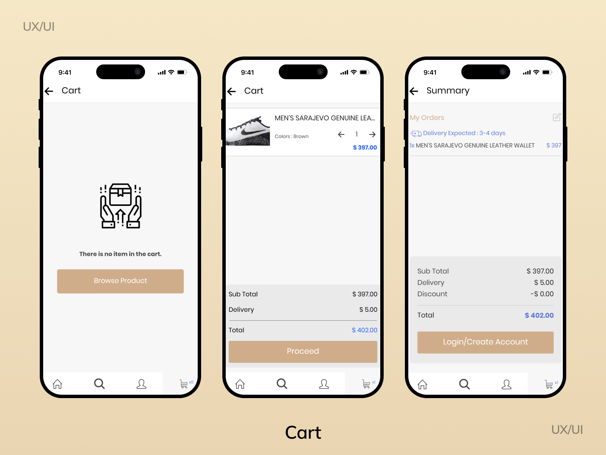

# Shopping Cart App

## Table of Contents

- [Introduction](#introduction)
- [Features](#features)
- [Installation](#installation)
- [Usage](#usage)
- [Screenshots](#screenshots)
- [Contributing](#contributing)
- [License](#license)

## Introduction

Welcome to the Shopping Cart App! This is a full-featured shopping cart application built with React Native. The app allows users to browse products, add them to their cart, and proceed to checkout. This README provides instructions on how to get started, use the app, and contribute to its development.

## Features

- Browse products
- Add products to the cart
- Remove products from the cart
- View cart details
- Checkout process
- User authentication
- Product search functionality
- Responsive design

## Installation

To get started with the Shopping Cart App, follow these steps:

1. Clone the repository:
    ```bash
    git clone https://github.com/Hamza-Maa/Shopping-Cart-App.git
    cd shopping-cart-app
    ```

2. Install the dependencies:
    ```bash
    npm install
    ```

3. Link native dependencies:
    ```bash
    npx react-native link
    ```

4. Run the app on your device or emulator:
    ```bash
    npx react-native run-android
    # or
    npx react-native run-ios
    ```

## Usage

1. Open the app on your device or emulator.
2. Browse through the list of available products.
3. Tap on a product to view its details.
4. Add products to your cart.
5. View the cart by tapping the cart icon.
6. Proceed to checkout and complete the purchase.

## Screenshots
Here are some screenshots of the Shopping Cart App:
<p align="center">
  
  
  
  
</p>

## Contributing

We welcome contributions to the Shopping Cart App! If you have any improvements or new features to add, please follow these steps:

1. Fork the repository.
2. Create a new branch for your feature or bugfix:
    ```bash
    git checkout -b feature-name
    ```
3. Make your changes and commit them:
    ```bash
    git commit -m "Description of feature or fix"
    ```
4. Push your changes to your forked repository:
    ```bash
    git push origin feature-name
    ```
5. Create a pull request to the main repository.

## License

This project is licensed under the MIT License. See the [LICENSE](LICENSE) file for more details.
